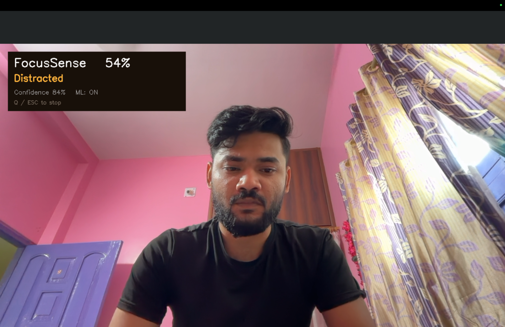
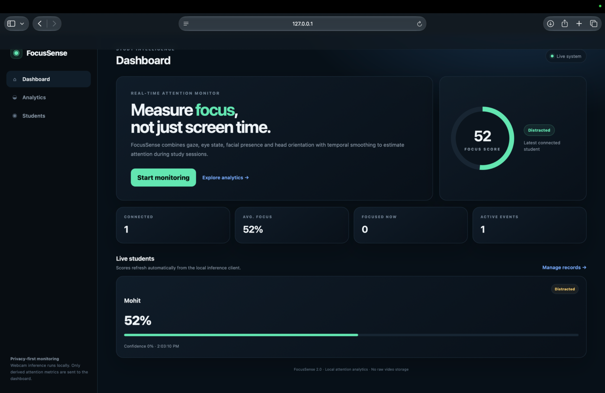
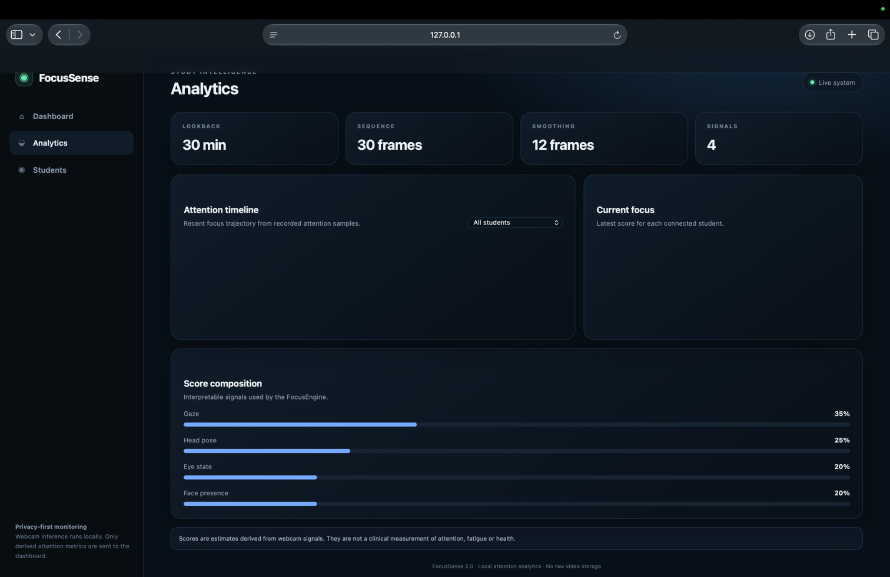
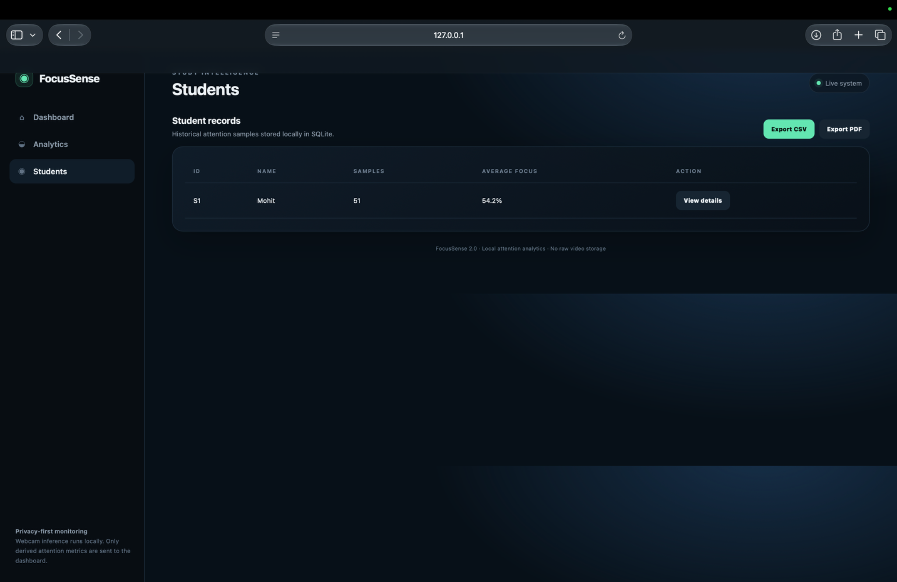
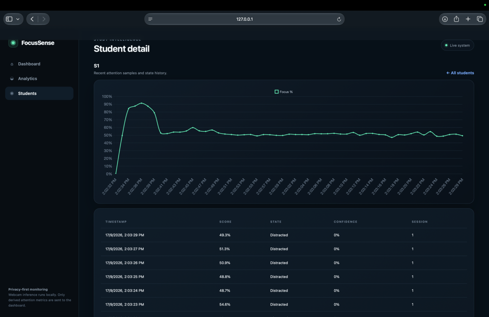

# FocusSense 2.0

Real-time, privacy-first study attention analytics using MediaPipe/OpenCV, an optional trained CNN/LSTM classifier, an interpretable focus engine, and a Flask + SQLite dashboard.

MCA minor project, built with Sameer Patel.

## Screenshots

<table>
<tr>
<td width="50%"><br/><sub><b>Focus monitor</b></sub></td>
<td width="50%"><br/><sub><b>Focus analysis</b></sub></td>
</tr>
<tr>
<td width="50%"><br/><sub><b>Student records</b></sub></td>
<td width="50%"><br/><sub><b>Student history</b></sub></td>
</tr>
<tr>
<td width="50%"><br/><sub><b>Live focus detection</b></sub></td>
<td width="50%"></td>
</tr>
</table>

## What changed
- Clean Flask API with session lifecycle and event logging
- Focus score from gaze, head pose, eye state and face presence
- Temporal smoothing to reduce frame-to-frame flicker
- Focused / Distracted / Drowsy / Away / Unknown states
- Optional use of the existing `focussense_model.h5`; heuristic scoring remains available when TensorFlow/model loading is unavailable
- Live student dashboard, analytics, student history, CSV/PDF exports
- Responsive UI and privacy-oriented local processing
- Evaluation script for measured model metrics

## Run
```bash
python3 -m venv venv
source venv/bin/activate
pip install -r requirements.txt
python init_db.py
python dashboard_server.py
```

In another terminal:
```bash
source venv/bin/activate
python run_focus_live.py --student-id S1 --name "Student 1"
```

Then open `http://127.0.0.1:5000`.

## Architecture
```text
Webcam -> MediaPipe FaceMesh -> signal extraction -> temporal FocusEngine
                                      |                    |
                                      +-> optional CNN/LSTM +
                                                           v
                                                   Flask REST API
                                                           v
                                                     SQLite database
                                                           v
                                               Dashboard / Analytics / Reports
```

## Model evaluation
Run:
```bash
python evaluate_model.py
```
The script reports metrics computed from the repository's labeled `.npy` sequences. Do not copy metrics into a report until you have run the evaluation and verified the test protocol.

## Privacy
The camera client processes frames locally and sends derived scores/signals to the local dashboard. Raw webcam frames are not stored by the application.

## Original project materials
The existing training data, model, PPTs, screenshots and original helper scripts are retained in this release where useful. The live path uses the cleaned 2.0 implementation.

## About me

Mohit Raj, MCA graduate from RV College of Engineering. [GitHub](https://github.com/mohitrajjj) · [LinkedIn](https://linkedin.com/in/mohit-rajj) · [LeetCode](https://leetcode.com/u/vduZBjuexI/)
